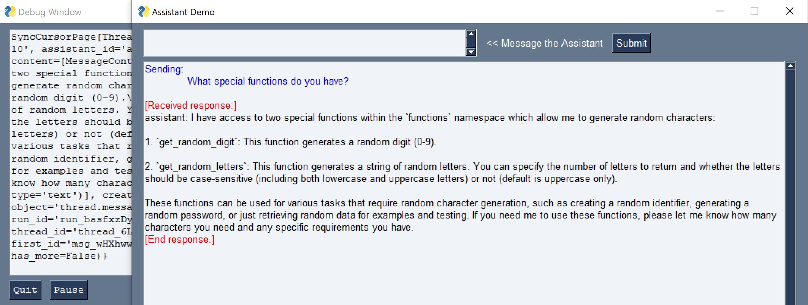

Note: Subsequent to this project, I published [an app that demos _all_ of the Assistant tools here](https://github.com/dbookstaber/OpenAI_Assist_All_Tools).

# QuickStart
1. Enter your OPENAI_API_KEY in a local .env file.
2. Run gui.py

This is a simple demonstration of an OpenAI Assistant with Functions, including multiple callbacks for multiple tools.
The function tools here give the Assistant the ability to generate random numbers and strings,
    which is something a base Assistant cannot do.
* The GUI is minimal.  The user/assistant interactions are also written to [`AssistantLog.md`](#sample-assistantlogmd).
* The complete OpenAI interactions (which are mostly encoded in JSON) are printed to `STDOUT`.
* When creating the assistant, this code stores the Assistant ID in `.env` to avoid recreating it in the future.  A list of assistants that have been created in your OpenAI account can be found at
    https://platform.openai.com/assistants

**Requirements:** You will need an `OPENAI_API_KEY`, which should be entered in a local `.env` file.  
    See https://platform.openai.com/api-keys

## Screenshot

# Sample `AssistantLog.md`
## 2023-11-26 11:58:36
Beginning thread_PTAF6tOtvesOe9hT5deOOD2c

**User:** `Generate a random number between 20 and 60`

**Assistant:** 
To generate a random number between 20 and 60, we can start with the smallest digit (2 for 20) and the largest digit (6 for 60) and then fill the rest of the number with random digits as needed. Since the number range is between 20 and 60, we only need the tens digit to be either 2, 3, 4, or 5 and the units digit can be any from 0 to 9. 

Here's how we can construct the random number:
1. Based on the digits 2, 3, 4, 5, we can pick one randomly as the tens digit.
2. For the units digit, we can randomly select any digit from 0 to 9.

Now let's proceed to generate the two digits.It looks like the random digits generated are 0 and 3. However, we needed to choose a random tens digit between 2 and 5, so we will adjust this process to make sure we follow the specified range.

For the tens digit, let's correct the approach:
- We need a random digit from the set {2, 3, 4, 5} which represents tens 20, 30, 40, and 50.
- We could map a single random digit (0-3) to the tens options (2-5).

For the units digit, we can use the digit 3 that has already been generated, as it falls within the proper range (0-9).

Now let's generate the correct tens digit according to our new approach.The random tens digit generated is 4, which we can now map to our range. Mapping the digit 4 from the range 0-3 to 2-5 gives us the following:

- 0 -> 2
- 1 -> 3
- 2 -> 4
- 3 -> 5
- 4 -> This is outside the range, so we'll need to generate a new digit.

It looks like an additional step is necessary because the digit 4 does not map to our desired range. I will generate another random digit and ensure that it is within the range of 0 to 3. Let's generate a correct tens digit again.The random tens digit generated this time is 2, which we can map to our tens range for the number (20, 30, 40, 50) as follows:

- 0 -> 2
- 1 -> 3
- 2 -> 4
- 3 -> 5

The digit 2 maps to 4 in the tens place, making our tens digit 40. 

Combining this with the previously generated units digit of 3, we get the random number 43, which is within the range of 20 to 60.

---
## 2023-11-26 12:25:03
Beginning thread_9wQhNJAEzKeJtfLwuscKT43O

**User:** `Create a random password with at least 6 characters`

**Assistant**:
Here's a random password with at least 6 characters: `PKhE75`

---
**User:** `How did you generate that?`

**Assistant**:
To generate the random password `PKhE75`, I used the following steps:

1. **Random Letters**: I requested a string of 4 random letters, specifying that it should be case sensitive. This means it could include both uppercase and lowercase letters. The result was `PKhE`.

2. **Random Digits**: I requested two random digits. These were provided separately, and the results were `7` and `5`.

3. **Combining**: I then combined the string of random letters with the two random digits to create a 6-character password. 

The resulting mix of letters and numbers ensures a basic level of complexity for the password. The tools used operate by generating random values which can be combined to form a password or any string needing an element of randomness.

---
**User:** `Why did you decide to request 4 letters instead of some other number of letters?`

**Assistant**:
I decided to request 4 letters (with a mix of upper and lower case) followed by 2 digits to meet the minimum requirement of a 6-character password while maintaining simplicity and providing a balance between letters and numbers. 

Here's the rationale behind this decision:

- By using 4 letters, I ensured that the majority of the password would be alphabetic, making it easier to remember while still random enough for security.
- Adding 2 digits increases the complexity and unpredictability of the password without making it too complicated.
- A 6-character password is the minimum length you specified, so I allocated the characters to both letters and numbers to create a password that is not only random but also consists of different character types, which is a good practice for creating secure passwords.

This format (4 letters + 2 digits) is just one of many possible configurations for a secure password. Depending on security requirements, passwords can be made longer and can include additional character types such as symbols to further enhance their strength.

---
